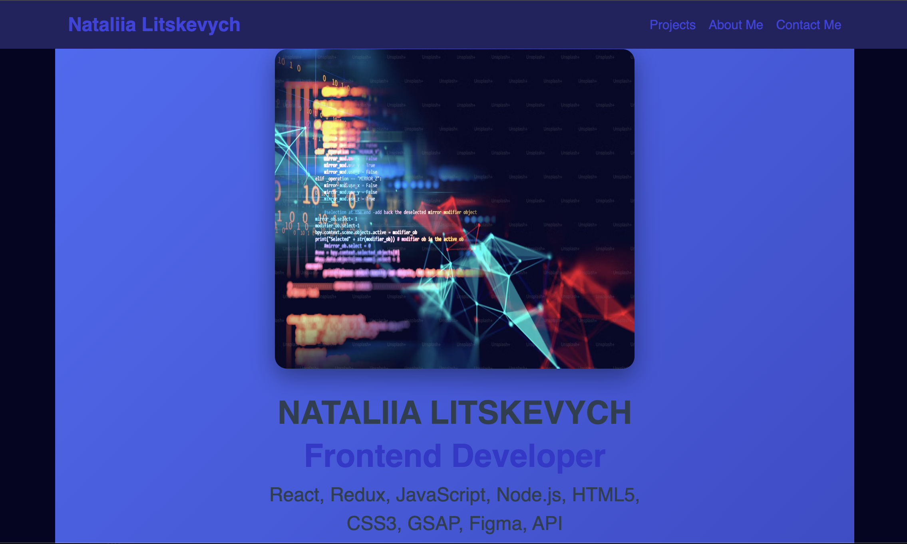

# 🌐 Personal Portfolio

Welcome to my personal portfolio website!  
This project highlights my **frontend development skills, projects, and design approach** with a focus on clean UI, responsive layout, and smooth animations.

---

## ✨ About the Project
The portfolio is designed to showcase my work as a **Frontend Developer**.  
It includes:
- A hero section with introduction  
- A projects showcase with live demos  
- An about me section highlighting skills and background  
- Contact form and social links for easy communication  

---

## 🛠️ Tech Stack
- **HTML5** – semantic structure  
- **CSS3** – modern styling & responsive design  
- **JavaScript (ES6+)** – interactivity  
- **GSAP** & **AOS** – animations  

---

## 📸 Preview

---

## 🔗 Live Demo
👉 View My Portfolio: https://myportfolio-nataliia-litskevych.netlify.app

👩‍💻 Author

Nataliia Litskevych
Frontend Developer | Passionate about clean code, design, and building user-friendly web experiences.

📫 Connect with me:

👩‍💻 Author

Nataliia Litskevych
Frontend Developer | Passionate about clean code, design, and building user-friendly web experiences.

📫 Connect with me:

LinkedIn
https://www.linkedin.com/in/nataliia-litskevych

GitHub
https://github.com/NataliiaLitskevych
